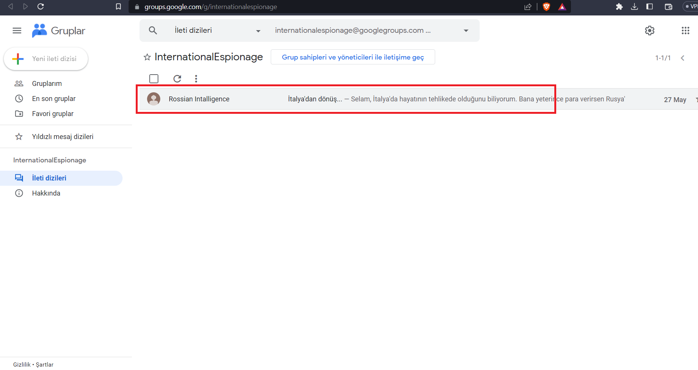

# Kapsul CTF OSINT Çözümleri: 

## Belediyenin Sana İhtiyacı Var

https://www.usom.gov.tr/ sitesinde "Zararlı Bağlantılar" sekmesinden "konya" yanzdığınızda en güncel olan "konyamkart.net" sitesi aradığımız sitedir.

https://www.whois.com/whois/konyamkart.net şeklinde whois sorgusu yaparak domain posta koduna erişebilirsiniz.

    Flag : HACKME{M4K3K1}

## Bir Gece Ansızın Gelebilirim

Verilen linke tıkladığımızda sonuç gelmediğini görüyoruz.

https://web.archive.org sitesinden verilen youtube linkini web arşivde arayıp, kanalın snapshotlarını buluyoruz. 20 Mayıstaki snapshota bakabiliriz.

Kanalda görünmeyen videoyu arşivde bulduk:

Tarama çubuğundaki youtube linkini ayıklayıp yeni sekmede videoyu oynatabilirsiniz.

Videonun 30.saniyesinde bir QR kod göreceğiz :

QR'ı tarattığımızda google mapste bir yer açılıyor :

Yorumlarda flagi görüyoruz.

    Flag : HACKME{PEŞİNDEYİZVESENİİYİTANIYORUZ}
    
## Derya Nolur Geri Dön Seni Çok Seviyom

"derya bakanlık hack" tarzı bir google araması yaptığınızda "aşkı için maliye bakanlığı sitesini hack'lemek" sonucunu görürsünüz.

"aşkı için maliye bakanlığı sitesini hacklemek" şeklinde bir arama daha yaparak görsellerde sonucu bulabiliriz.

    Flag : HACKME{TheMato}
    
## Kaçma Yorgun Öleceksin

Verilen site yine sonuç döndürmüyor ve archive kayıtları da yok. 

https://toolbox.googleapps.com/apps/dig adresinden dns kayıtlarını inceliyoruz :

txt kısmında bir link bırakıldığını görüyoruz ("https://groups.google.com/g/internationalespionage")

Linke gidelim :

Flagi bulduk

    Flag : HACKME{82NIJNIN0VG0R0D}
    
## Yoksa Hala Takip Etmediniz Mi?

Ctfi hazırlayan LastGuard'ın instagram adresindeki fotoğrafta flagi buluyoruz.

     https://www.instagram.com/lastguardsec/
     
 
 
 
 @ElliotAlderson

